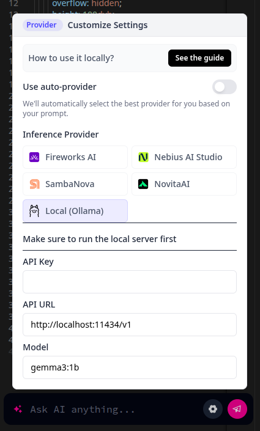

# DeepSite Locally 🚀



Run **DeepSite** on your own environment, without depending on Hugging Face!
Perfect for those who want to customize, integrate, or simply have full control over the platform.

---

## How to Run DeepSite Locally

### 1. Clone the repository
```bash
git clone https://github.com/MartinsMessias/deepsite-locally.git
```

### 2. Install dependencies
(Make sure you have **Node.js** installed)
```bash
npm install
```

### 3. Build the project
```bash
npm run build
```

### 4. Start the server
```bash
npm run start
```

### keywords
deepsite local hosting, deepsite run locally, deepsite self-hosted, how to run deepsite locally, install deepsite on your machine, deepsite local server setup, deepsite offline mode, deepsite localhost tutorial, deploy deepsite on your own server, deepsite self-install guide, how to host deepsite on localhost step-by-step, can deepsite run offline on my computer, deepsite docker installation guide, full guide to running deepsite locally without internet, deepsite self-host vs cloud hosting comparison, deepsite performance tips when running locally, requirements to run deepsite on local environment, best practices for self-hosting deepsite platform, how to speed up deepsite in a local environment, common errors when running deepsite locally and how to fix, deepsite vs other ai site builders local run comparison, top reasons to run deepsite on your own server, is deepsite open-source and local-friendly

